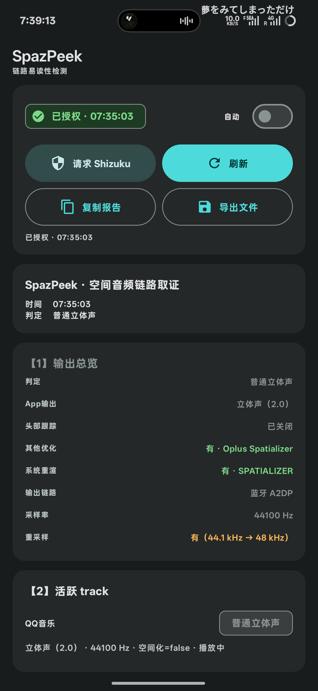
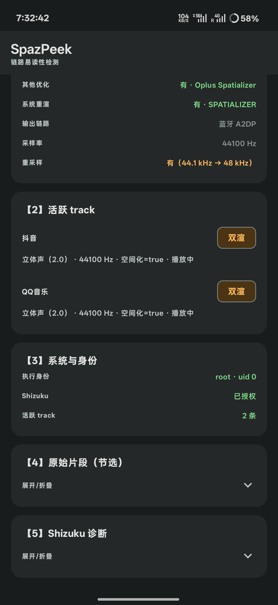

# SpazPeek

**Android 空间音频链路取证工具 —— 一眼看穿「双渲」。**

Spatial audio chain forensics for Android — detect dual-rendering, head tracking, resampling and more.

---

在蓝牙耳机开启空间音频的场景下，如果 **App 自己渲染了一遍空间音频、系统又渲染一遍**（双重渲染），听感会变糊。SpazPeek 通过 Shizuku 直读系统音频服务的实时状态，把整条链路的关键信息逐项列出来。

## 功能

- 🎧 **双渲检测** —— App 已自行渲染（`isSpatialized=true`）却仍输出立体声 → 系统会再渲一遍，实时标记「双渲」
- 📼 **App 输出格式** —— 单声道 / 立体声（2.0）/ 5.1 / 7.1.4 等通道布局，直接给出人话名称
- 🧭 **头部跟踪** —— 开启 / 关闭 / 相对世界 / 世界锁定
- ⚙️ **系统重渲** —— Spatializer 渲染引擎是否有进程在跑
- 🎛️ **其他音频优化** —— Oplus Spatializer / Dolby / Dirac / DTS 检测
- 🔗 **输出链路** —— 蓝牙 A2DP / 扬声器 / 有线耳机 / USB 等
- 🔁 **重采样检测** —— 源采样率 vs 输出采样率（如 44.1 kHz → 48 kHz）
- 📋 一键复制 / 导出报告 · 3 秒自动刷新

## 截图

| 输出总览 | 明细卡片 |
|---|---|
|  |  |

## 工作原理

以 shell/root 身份（通过 [Shizuku](https://shizuku.rikka.app/)）读取系统音频服务的原始状态：

| 数据源 | 用途 |
|---|---|
| `dumpsys audio` | 活跃播放会话（AudioPlaybackConfiguration） |
| `dumpsys media.audio_flinger` | 输出线程 / 混音器 / 音效链 / 采样率 |
| `dumpsys media.audio_policy` | 头部跟踪状态 |

纯本地运行，**无网络权限**，不上传任何数据。

## 构建

要求：JDK 17+、Android SDK 35。

```bash
./gradlew assembleDebug
```

产物：`app/build/outputs/apk/debug/app-debug.apk`

> 本工程亦支持在 Android 设备内（proot + aarch64）直接构建：在 `~/.gradle/gradle.properties` 中加入以下配置即可（普通 PC 构建无需任何额外配置）：
>
> ```properties
> android.aapt2FromMavenOverride=/root/Android/build-tools/35.0.0/aapt2
> android.aapt2.process.daemon=false
> ```

## 使用

1. 安装 [Shizuku](https://shizuku.rikka.app/) 并启动服务
2. 打开 SpazPeek →「请求 Shizuku」授权
3. 播放音乐（蓝牙 + 空间音频场景最佳），点「刷新」
4. 看【1】输出总览 —— 链路状态一眼到底

## 兼容

- minSdk 29 / targetSdk 35
- Material 3（动态取色 / 深色模式）
- 检测基于 AOSP 标准 dump 格式，厂商音效（如 Oplus Spatializer）已适配

## License

[MIT](LICENSE)
